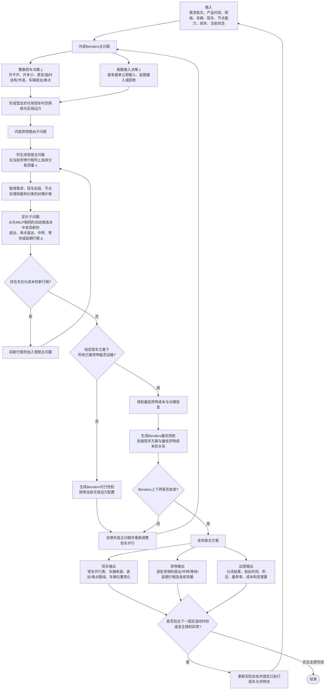

# Benders—列生成联合分解完整方案

## 1. 方案定位

本方案在不改变既有业务定义的前提下，将班车—货物联合优化分为两个相互反馈的层次：

- **外层Benders主问题**：决定离散的班车开行、车辆来源、车辆时空移动和紧急插单接入；
- **内层货物路由子问题**：给定外层班车方案后，使用列生成动态发现货物行程，并连续分配各条行程上的等效吨数。

算法虽然按“外层提出班车方案—内层反馈货物结果”迭代，但第一次班车方案并不固定。货物可行性和最低路由成本会通过Benders割持续反馈，直至形成最终联合决策。

## 2. 核心流程图

## 3. 决策边界表

该表必须作为方案定义保留。网页实现时可以放在流程图右侧，或作为独立的“决策分层”模块。

| 业务决策 | 外层Benders主问题 | 内层列生成货物子问题 |
|---|:---:|:---:|
| 原定班车是否开行 | ✓ |  |
| 临时自有车数量 | ✓ |  |
| 外请车辆数量 | ✓ |  |
| 车辆采用直达还是串点路线 | ✓ |  |
| 自有车辆在节点—时段间的位置变化 | ✓ |  |
| 紧急插单的接入时刻或拒绝 | ✓ |  |
| 货物搭乘哪些班车 |  | ✓ |
| 货物是直达、串点直达还是中转 |  | ✓ |
| 货物是否留仓等待或延期 |  | ✓ |
| 每条货物行程分配多少吨 |  | ✓ |
| 同批货物是否分流 |  | ✓ |
| 货物服务短缺和延误量 |  | ✓ |

### 关键术语

- **车辆直达**：班车路线仅包含起点和终点；由外层决定。
- **车辆串点**：同一辆车依次经过一个中间节点；由外层决定。
- **货物直达**：货物只搭乘一个车辆任务且不换车；由内层决定。
- **货物串点直达**：货物搭乘同一辆串点班车经过中间节点但不换车，中转次数为0；由内层决定。
- **货物中转**：货物在中间节点卸下并换乘另一车辆任务；由内层决定。
- **留仓/等待**：货物在节点跨时段等待后续班车；由内层决定。
- **分流**：同一需求批次在两条及以上行程上的连续分配量同时大于0，它是多条行程共同形成的结果，不是一条单独行程。

## 4. 输入

每次日初或滚动重优化使用：

- 节点、物理连接和3小时时空网络；
- 原定班车和允许的直达/最多一个串点路线；
- 自有车辆初始或当前节点位置；
- 外请车辆时段上限；
- 节点处理能力；仓储能力假设充足且不设置容量上限；
- OD—产品—到货批次的起点、终点、到货时刻、预测/实际吨数；
- 加急、普通、经济产品的时效和服务目标；
- 已执行班车任务、货物流和上一版已发布计划；
- 车辆故障、紧急撤单或紧急插单信息；
- 运输、装卸、中转、持有、延误、服务短缺和变更成本。

## 5. 外层Benders主问题

### 5.1 主要变量

- \(y_m\in\mathbb Z_+\)：候选班车任务 \(m\) 的开行车辆数；
- \(v_{nt}\in\mathbb Z_+\)：节点 \(n\) 在时段 \(t\) 的自有车辆数；
- \(z_k\in\{0,1\}\)：紧急插单是否在时段 \(k\) 接入；
- \(z^{reject}\in\{0,1\}\)：观察期内是否拒绝插单；
- \(\Theta\ge0\)：给定班车和接入方案下的最低货物运营成本估计；
- 班车任务变化的绝对值线性化变量。

### 5.2 目标

普通重优化：

\[
\min C^{vehicle}(y)+C^{vehicle\_change}(y)+\Theta.
\]

紧急插单采用分层目标：

1. 最小化 \(z^{reject}\)；
2. 最小化 \(\sum_k(k-k_0)z_k\)；
3. 最小化车辆成本、货物成本和变更成本。

### 5.3 主问题约束

- 原定班车不开、直达或串点方案之间的互斥；
- 临时自有车辆任务开行数量；
- 外请车辆数量和时段上限；
- 自有车辆节点—时段平衡；
- 车辆故障后的可用车辆扣减；
- 已执行班车任务固定；
- 插单接入选择 \(\sum_kz_k+z^{reject}=1\)；
- 已加入的Benders可行性割和最优性割。

## 6. 内层货物路由子问题

固定外层给出的 \(\bar y,\bar z\) 后，货物子问题为连续线性规划。

### 6.1 行程列与变量

- \(p\in P_d\)：需求 \(d\) 的完整货物行程；
- \(x_{dp}\ge0\)：需求 \(d\) 在行程 \(p\) 上分配的等效吨数；
- \(u_g\ge0\)：产品等级 \(g\) 的服务目标短缺吨数；
- 货物改道量的绝对值线性化变量。

一条行程列完整记录：搭乘的班车任务序列、各次上下车时刻、等待节点和时段、中转次数、到达时刻、是否准时，以及占用的运输区段、处理能力和留仓时段。留仓时段计成本但不受仓容上限约束。

### 6.2 目标

\[
Q(\bar y,\bar z)=
\min
C^{handling}(x)+C^{transfer}(x)+C^{holding}(x)
+C^{delay}(x)+C^{shortfall}(u)+C^{cargo\_change}(x).
\]

### 6.3 主要约束

需求完整分配：

\[
\sum_{p\in P_d}x_{dp}=q_d(\bar z),\qquad\forall d.
\]

班车区段运力：

\[
\sum_d\sum_{p\in P_d}a_{dpr}x_{dp}
\le
20\sum_m b_{mr}\bar y_m,
\qquad\forall r.
\]

此外包括：节点处理能力、最大中转次数、时序连通、软服务水平、已执行货物流固定和货物改道成本。仓储能力假设充足且不设置容量上限，留仓量和留仓成本仍完整记录。

## 7. 子问题内部的列生成

### 7.1 初始列

每个需求先放入少量代表性行程：最快行程、低成本行程和一条延期行程。列生成阶段可设置高惩罚人工未服务变量保证初始受限主问题可求解，但最终业务方案必须将其降为0。

### 7.2 受限主问题

在当前列集合 \(\bar P_d\) 上连续分配货量，取得需求、运输区段、节点处理和服务水平约束的对偶价格。

### 7.3 定价子问题

针对每个需求，在时空网络上求解带资源限制的最短路，状态包含当前节点、时段、中转次数、已访问节点和服务状态。运输弧表示搭乘直达或串点班车，等待弧表示留仓。

定价产生新的货物行程 \(p\)，而不是货量。新行程加入后，受限主问题重新优化全部连续货量 \(x_{dp}\)。

### 7.4 停止条件

当所有需求在与V6 MILP相同的冻结候选行程池中均不存在负约化成本行程时，列生成结束。若定价被时间上限提前终止，只能称为近似货物子问题，不能据此宣称外层Benders严格收敛。

## 8. Benders反馈

### 8.1 子问题不可行

若给定班车方案无法运输所有已接货物，使用Farkas对偶射线生成可行性割：

\[
0\ge \alpha^F+\sum_m\beta_m^Fy_m+\sum_k\gamma_k^Fz_k.
\]

该割排除当前及同类不足运力配置，但不直接规定具体货物路径。

### 8.2 子问题可行

列生成收敛后，利用货物子问题对偶解生成最优性割：

\[
\Theta\ge \alpha+\sum_m\beta_my_m+\sum_k\gamma_kz_k.
\]

该割向外层刻画不同班车运力和接入选择能够实现的最低货物成本。

### 8.3 外层停止

外层同时维护：

- 下界：Benders主问题目标；
- 上界：当前整数班车方案的实际车辆成本加内层最低货物成本。

当上下界达到设定容差，且内层列生成均准确收敛时，得到完整候选班车任务与V6冻结候选货物行程空间下的联合解。第一版不声称覆盖固定候选池之外的完整时空路径空间。

## 9. 滚动与异常业务逻辑

### 每6小时固定滚动

- 核实实际货量、车辆位置、节点积压和剩余运力；
- 固定决策时刻以前已经执行的班车和货物流；
- 复用仍有效的货物列；
- 对剩余货物重新执行外层Benders和内层列生成。

### 车辆故障

- 只从故障时刻实际可用的自有车辆中扣减；
- 外层重新决定未来班车任务；
- 内层重新路由尚未执行的货物。

### 紧急撤单

- 只删除尚未发运的撤单货物；
- 已执行货物流不回滚；
- 外层和内层共同调整未来计划。

### 紧急插单

- 接入时刻或拒绝由外层 \(z\) 决定；
- 每个候选接入时刻对应的货物行程由内层定价生成；
- 延误与准时率始终从原始插单时刻计算；
- 外层第一优先避免拒单，第二优先最早接入，第三优先最低成本。

## 10. 输出

### 班车与车辆

- 各时段原定、临时自有和外请班车的开行数量；
- 每个任务的直达或串点路线；
- 自有车辆节点—时段位置；
- 故障和滚动调整后的任务变化。

### 货物

- 每个OD—产品—到货批次使用的全部行程；
- 各行程连续分配吨数；
- 直达、串点直达、中转、留仓、延期和分流结果；
- 到达时刻、延误时段和服务状态。

### 评价指标

- 车辆、装卸、中转、持有、延误、服务短缺和变更成本；
- 产品准时率；
- 插单准入结果；
- Benders上下界和Gap；
- Benders迭代次数；
- 每次内层列生成迭代数、初始/最终列数和定价时间；
- 端到端墙钟时间与独立约束校验结果。

## 11. 与当前固定候选MILP的对比

| 项目 | 当前联合MILP | Benders—列生成方案 |
|---|---|---|
| 班车任务 | 一次性进入联合MILP | 外层Benders整数主问题 |
| 货物行程 | 每批预生成最多36条 | 内层按对偶价格动态生成 |
| 货量 | 连续联合分配 | 内层连续分配 |
| 班车—货物反馈 | 同一模型约束直接耦合 | 可行性割和最优性割迭代反馈 |
| 路径范围 | 固定候选集合 | 定价能够探索的完整时空路径空间 |
| 精确性 | 限时候选路径MILP | 外层与内层均收敛时可严格求解同一冻结候选路径模型 |
| 实现难度 | 中等 | 高 |
| 当前规模下速度 | 较容易快速得到可行解 | 不保证更快，存在嵌套迭代开销 |

## 12. 实施与验证顺序

1. 保留当前联合MILP作为固定候选基准；
2. 先在4个正确性验证算例上实现内层列生成，核对约化成本与货量守恒；
3. 再实现外层Benders可行性割与最优性割，核对上下界；
4. 用1个小型正式算例比较固定MILP和联合分解的目标值与运行时间；
5. 确认没有人工变量残留、所有割有效且独立校验通过；
6. 再运行已冻结的12个正式演示算例（四类各3个）。

## 14. 当前代码实现口径

代码入口为项目根目录 `run_benders_cg_all.py`，求解器位于 `src/freight_opt/decomposition.py`。实现保持V6的冻结输入、候选班车集合、每批最多36条候选行程、全部成本、软服务水平、滚动时点、异常、已执行决策固定和验证器不变，仅改变求解组织方式。

为保证与固定候选MILP的严格配对公平性，第一版定价不是扩展到候选池外，而是在同一个有限行程池中从少量初始列开始，根据对偶约化成本逐轮加入。外层增加节点割集运力和最低吨·区段运力约束，它们都是货物流可行性的必要条件，只强化主问题松弛，不改变业务可行域。

紧急插单的离散接入变量在代码中由外层协调器按“立即、逐时段延期、拒绝”的字典序枚举实现；每个候选接入时刻仍调用同一Benders—列生成核心。该实现与已确认的三层优先级等价，并完整记录每次接入尝试。

每个日初、周期滚动和事件重调度均记录：外层候选班车方案、上下界、Gap、可行性割和最优性割系数；内层每轮非零对偶、最小约化成本和新增列；初始与最终列池；停止原因、人工变量、预处理、求解和复原时间；最终班车、货物行程、成本、服务率、变更量和计划快照。零对偶不逐项重复存储，日志中明确标记“未出现即为0”。

## 13. 网页展示建议（后续）

主页面只显示第2节核心流程图。第3节决策边界表可以：

- 放在流程图右侧作为独立模块；或
- 点击“外层主问题”“内层货物子问题”后展开；或
- 鼠标悬停对应节点时显示该层决策清单。

约束公式、对偶价格、Benders割、求解状态和停止条件不进入主业务流程图，可作为悬浮说明或“查看数学模型”侧栏。
