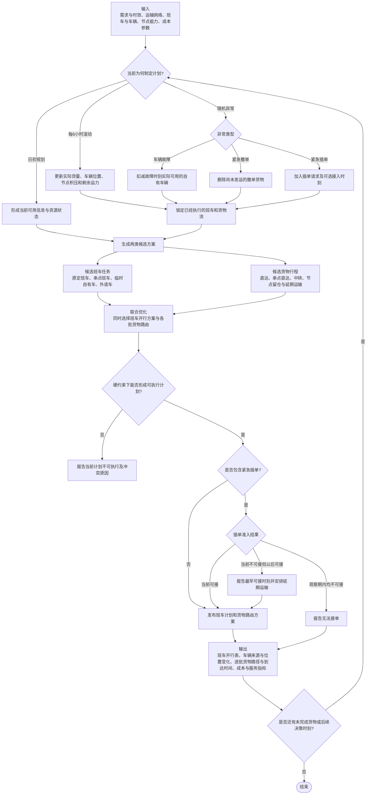

# Gurobi核心业务决策流程图

## 核心建模方式

本模型采用 **候选方案生成 + 联合MILP选择**：先生成候选班车任务和候选货物行程，再由Gurobi同时决定班车怎么开、每批货走哪条行程。

它不是“先排班车、再做货物路由”的顺序模型，也没有把问题分解成两个独立优化问题；班车决策与货物路由通过运力约束直接耦合，在同一个MILP中联合求解。

## “联合优化”到底在决定什么

### 班车开行决策

- 原定班车是否开行，以及采用直达还是允许一个串点的路线。
- 是否临时增加自有车辆任务。
- 是否使用外请车辆及使用数量。
- 每辆自有车开行后从原节点减少、到达后在目的节点增加，后续可继续执行任务。

### 货物路由决策

- 每个OD—产品—到货批次的货量可以分配到哪些候选行程，以及每条行程分配多少吨。
- 候选行程可包含直达、一次串点直达、中转、节点留仓和延期发运。
- 车辆开行决策提供分时段、分路段的运力；货物只有在相应班车被选择且仍有容量时才能使用该行程。

### 两类决策如何连接

对每一条班车的每一段运输区间，都满足：

\[
\text{所有使用该区间的货量}
\;\le\;
20\text{吨}\times\text{该班车开行车辆数}.
\]

因此Gurobi不能只选择一条成本最低的货物路径，也不能开出没有货物和车辆支撑的班车；它必须同时平衡班车成本、货物路由、车辆位置、节点能力、服务时效和变更成本。

## 适合放在网页悬浮提示或侧栏的信息

以下内容不进入主流程图：

- 每批需求最多保留36条候选行程。
- 一种车型，单车容量20等效吨。
- 节点处理能力、外请车辆上限和中转次数等具体约束；仓储能力假设充足，不设置仓容上限，留仓仍产生库存成本。
- 98% / 95% / 90%准时率及其短缺惩罚。
- Gurobi的300秒时限、5%目标Gap、求解状态与IIS解释。
- 运输、装卸、中转、持有、延误、服务短缺和变更成本的详细构成。
- 多算例并行只负责加速实验运行，不属于单个算例的业务决策流程。
